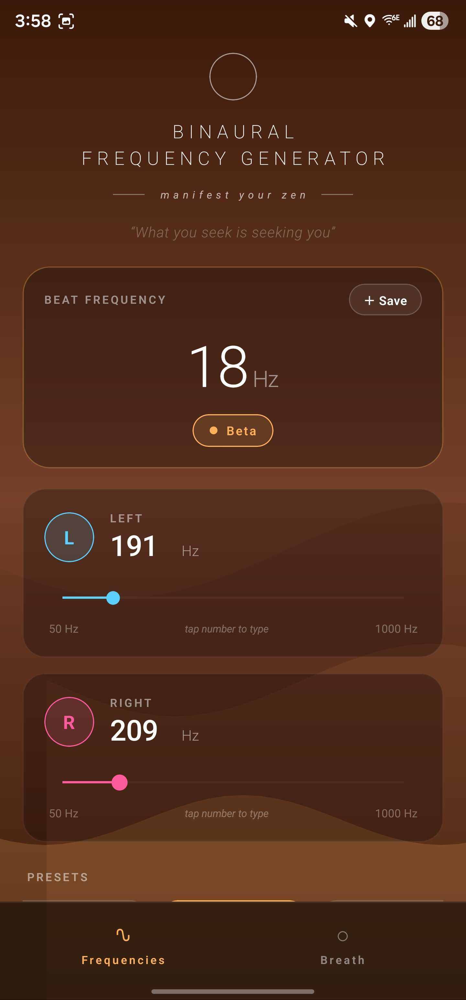
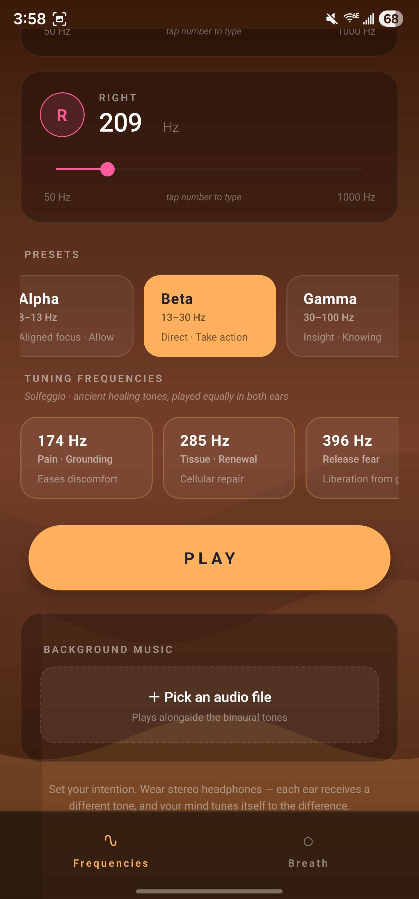
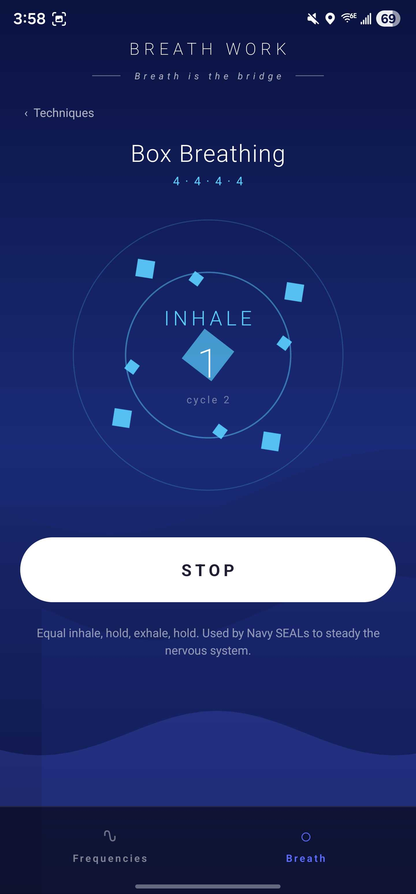
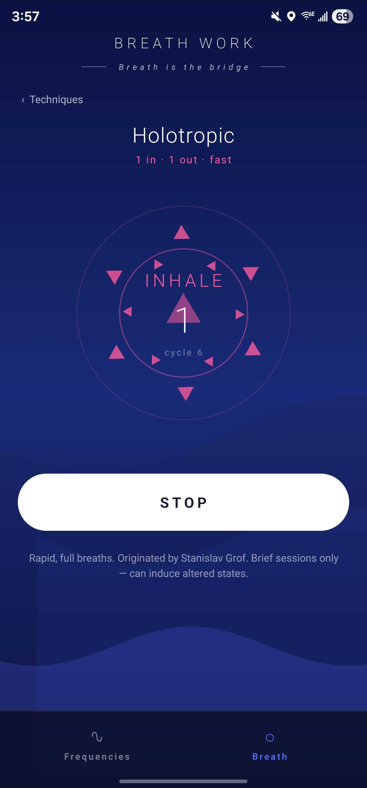

# Simply Ambient

> A binaural frequency generator and breath-work companion for Android and iOS.

<p align="center">
  
  
  
  
</p>

Simply Ambient pairs custom binaural beats with guided breath techniques. Pick a brainwave band, tune each ear independently (or type the exact Hz), layer in your own background music, save your favorite mixes, and step through breath sessions with phase-aware animation.

The philosophy is rooted in **New Thought / manifestation**: tune your vibration, set your intention, let the rest follow.

---

## Features

### 🎧 Frequencies tab

- **Independent left / right ear sliders** (50–1000 Hz). Tap any displayed Hz value to type it directly with the numpad.
- **Live audio updates as you slide** — the beat changes in real time without the old frequency overlapping the new one.
- **Brainwave-band presets** with manifestation-aligned blurbs:
  - **Delta** (0.5–4 Hz) — *Surrender · Restoration*
  - **Theta** (4–8 Hz) — *Visualize · Receive*
  - **Schumann** (7.83 Hz) — *Earth's heartbeat* (the planet's electromagnetic resonance)
  - **Alpha** (8–13 Hz) — *Aligned focus · Allow*
  - **Beta** (13–30 Hz) — *Direct · Take action*
  - **Gamma** (30–100 Hz) — *Insight · Knowing*
  - **Gamma-40** (40 Hz @ 250 Hz carrier) — *Memory · Clarity* (the frequency studied for cognitive support)
- **Tuning frequencies** — wrapped in a default 6 Hz theta beat so you get both the carrier's resonance and a real binaural beat:
  - **111 Hz** — Hypogeum cymatic tone (archaeo-acoustic)
  - **136 Hz** — OM / Cosmic Earth-orbit tone
  - **174 Hz** — Pain · Grounding (Solfeggio)
  - **256 Hz** — Scientific C / Verdi tuning
  - **285, 396, 417, 432, 444, 528, 639, 741, 852, 963 Hz** — full Solfeggio + companion tunings
- **Slide-to-tuning detection** — slide the L/R sliders so the carrier hits a tuning frequency (within 1 Hz) and the gold tuning theme + label activate automatically.
- **Custom presets** — name and save the current L/R combination. Long-press a saved chip to delete it. Built-in presets are protected. Stored locally via AsyncStorage so they survive app restarts.
- **Background music** — pick any audio file from your device. Plays alongside the binaural tones with its own play/pause and volume slider.

### 🌬 Breath Work tab

Sixteen techniques across two categories:

| Category | Technique | Pattern |
|---|---|---|
| Calming | Box Breathing | 4 in · 4 hold · 4 out · 4 hold |
| Calming | 4-7-8 | 4 in · 7 hold · 8 out |
| Calming | Diaphragmatic | 4 in · 6 out |
| Calming | Pursed-Lip | 2 in · 4 out |
| Calming | Coherent (5·5) | 5 in · 5 out — resonant breathing for HRV |
| Calming | Bhramari (Bee) | 4 in · 8 humming exhale — vagal stimulation |
| Calming | Nadi Shodhana | 4 in · 2 hold · 4 out — alternate-nostril |
| Calming | Sitali (Cooling) | 4 in (through tongue) · 6 out — pitta-cooling |
| Calming | Physiological Sigh | 2 short in · long out — fastest stress reset |
| Activating | Holotropic | 1 in · 1 out (rapid) |
| Activating | Shamanic | 2 in · 1 out |
| Activating | SOMA | 3 in · 1 out · 2 hold |
| Activating | Bhastrika (Bellows) | 1 in · 1 out forceful — energizes |
| Activating | Lion's Breath | 4 in · 4 roar-out — releases facial/throat tension |
| Activating | Kapalabhati | passive in · forceful out — skull-shining breath |

- **Two visual options**, switchable mid-session:
  - **Circle** — minimal scaling ring with phase label
  - **Mandala** — geometric polygon center with orbiting petals and a counter-rotating inner ring; petals expand outward on inhale and pull back on exhale, freezing during holds
- Per-second countdown, cycle counter, and smooth ease-in/out timing matched to each phase.
- The binaural tone you set on the Frequencies tab keeps playing while you're on this tab.

### 🎨 Living background

- A slow color field that breathes with the active band.
- Two huge rotating rounded shapes in the band's accent and secondary tones — the visible color morphs as they slowly spin past one another. Inspired by Rowno's [Chameleon background](https://codepen.io/Rowno/pen/EVEgJb) CodePen.
- Snaps to a new palette when you choose a different preset.

### 🔯 Chakras tab

Seven chakras with full attribution:
- **Root** (Muladhara · LAM · Earth · 396 Hz)
- **Sacral** (Svadhisthana · VAM · Water · 417 Hz)
- **Solar Plexus** (Manipura · RAM · Fire · 528 Hz)
- **Heart** (Anahata · YAM · Air · 639 Hz)
- **Throat** (Vishuddha · HAM · Ether · 741 Hz)
- **Third Eye** (Ajna · OM · Light · 852 Hz)
- **Crown** (Sahasrara · AUM · Consciousness · 963 Hz)

Each card shows the bija mantra, element, body location, what it governs, and what blocks look like. Tap to tune both ears around its carrier frequency with a 6 Hz theta beat — the whole app theme shifts to that chakra's color.

### 🌿 Doshas (Ayurveda)

Three constitutions on the chakra tab — **Vata**, **Pitta**, **Kapha** — each with its qualities, recommended balancing frequency, and recommended breath technique. Tap to apply.

### 🤲 Mudras

Every breath technique includes a paired hand mudra (Gyan, Anjali, Hakini, Shanmukhi, Vishnu, Bhairava, Pran, Apana, Chin, etc.) with placement instructions, shown in the breath session screen.

### 🌙 Lunar phase

A subtle indicator in the corner of the app shows the current moon phase (computed from Conway's algorithm) — passive ambient awareness.

### 💭 Manifestation language

A rotating set of New Thought aphorisms drifts across the top of the screen:
*"Thoughts become things" · "Energy flows where attention goes" · "What you seek is seeking you" · "You attract what you vibrate" · "As within, so without"*

---

## Tech stack

- **React Native** + **Expo SDK 54** — single codebase for iOS and Android
- **TypeScript**
- **expo-audio** — playback (and synthesized stereo PCM WAV for the binaural tones)
- **expo-document-picker** — picking the user's background audio file
- **expo-file-system** — caching the synthesized WAV between frequency changes
- **@react-native-async-storage/async-storage** — persisting custom presets
- **@react-native-community/slider**
- **expo-linear-gradient** — base color field
- **react-native-svg** — polygons for the mandala visualization
- **react-native-safe-area-context**

### How the binaural audio works

Every time the frequency changes, a **1-second 44.1 kHz 16-bit stereo PCM WAV** is generated in JavaScript — one full cycle of the left tone in the L channel, one of the right tone in the R channel, integer Hz so the 1-second loop closes seamlessly. The bytes are base64-encoded, written to `FileSystem.cacheDirectory`, and loaded into a single persistent `AudioPlayer` via `.replace()` so there's never a second player overlapping the first. Slider drags are throttled to ~220 ms to keep audio responsive without thrashing the synthesizer.

---

## Running locally

```bash
npm install
npx expo start
```

Then either:

- **Phone (easiest)**: install **Expo Go**, scan the QR code that prints in the terminal. Phone and computer must be on the same Wi-Fi.
- **iOS Simulator**: press `i` in the Expo terminal (Xcode required).
- **Android Emulator**: press `a` (Android Studio + an AVD required).

> ⚠️ **Use stereo headphones** to perceive the binaural beat. Phone speakers mix the L and R channels and the effect disappears.

---

## Project structure

```
.
├── App.tsx                  # Main app: tabs, state, audio, frequencies UI, animated background
├── BreathworkView.tsx       # Breath techniques + circle/mandala visuals
├── app.json                 # Expo config (icon, splash, plugins)
├── assets/                  # Icons + splash (minimal green leaf on white)
├── index.ts                 # Expo entry point
├── package.json
└── tsconfig.json
```

---

## Roadmap

- Standalone build via EAS (so the green-leaf icon shows up instead of Expo Go's icon)
- Sleep timer
- Shareable preset QR codes
- Apple Health / Google Fit integration for breath sessions
- Curated guided-meditation library

---

## Credits & inspiration

- Background animation inspired by [Rowno's "Chameleon background"](https://codepen.io/Rowno/pen/EVEgJb)
- Brainwave-band conventions from standard EEG / neuroscience literature
- Solfeggio frequency intents drawn from sound-healing tradition
- New Thought aphorisms from Wallace Wattles, Florence Scovel Shinn, Ernest Holmes, and similar lineage

---

## License

No license set yet — code provided as-is.
