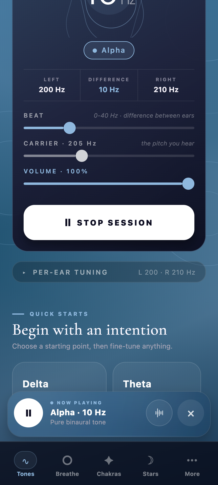
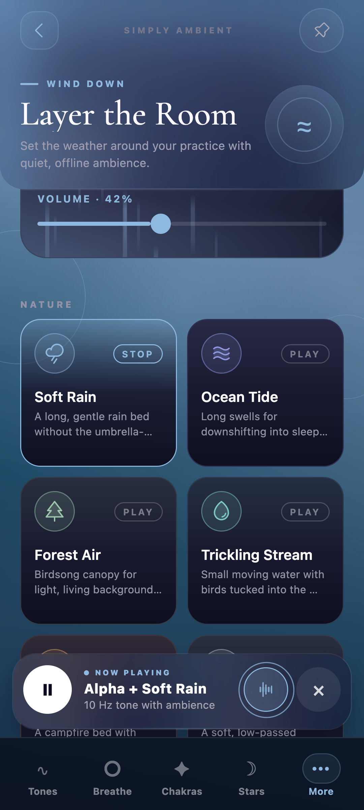
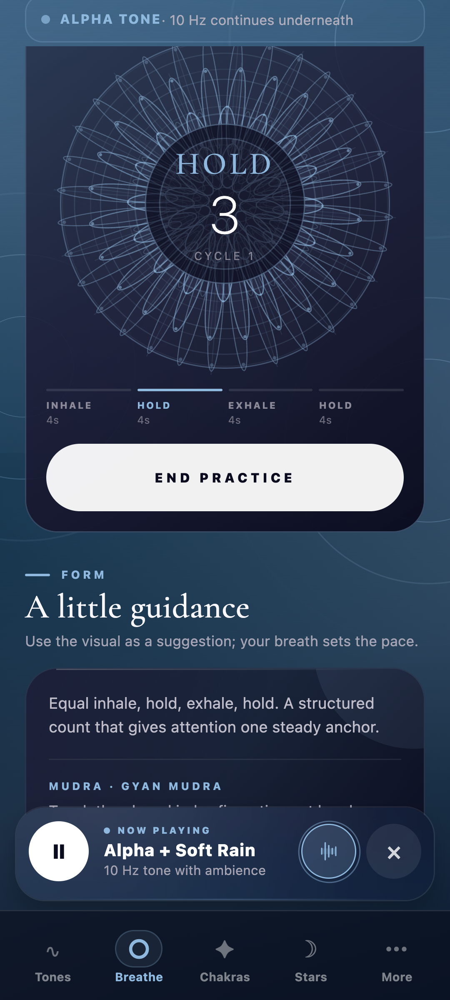
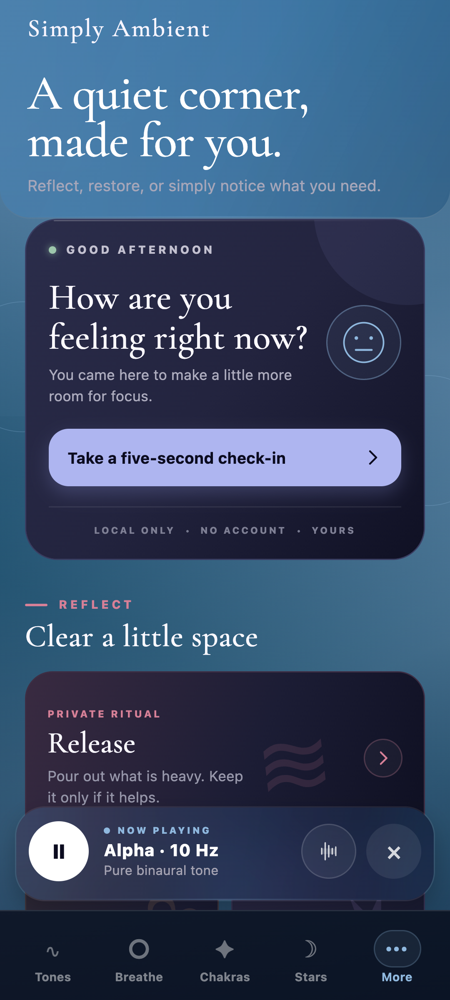

# Simply Ambient

> A calm, private space for sound, breath, and daily reflection.

Simply Ambient is a mobile-first ambient wellness studio built with React Native and Expo. It combines a real-time binaural frequency generator, 13 offline soundscapes, guided breathing, auto-advancing listening routines, chakra references, live horoscope readings, tarot, and local-first reflection tools in one fluid interface.

**Current release:** 2.0.0 in Google Play closed testing
**Also available:** [playable web build](https://binaural.vercel.app)
**Platforms:** Android and web today, with the React Native codebase prepared for iOS

<p align="center">
  
  
  
  
</p>

[Try the web app](https://binaural.vercel.app) · [Privacy policy](https://kaytiwari.github.io/Simply-Ambient/privacy-policy.html)

## What changed in 2.0.0

Version 2.0.0 is the first full ambient-studio release. Compared with the previous finished Android build, 1.0.5, it adds:

- A rebuilt beat-first Tones chamber with Carrier and Beat controls, advanced per-ear tuning from 50 to 500 Hz, a dedicated tone-volume lane, and Hz-responsive frequency orbits.
- Thirteen offline soundscapes with independent volume, gain-rebalanced playback, animated scene art, and support for layering a soundscape, binaural tone, and imported audio.
- Three auto-advancing routines: Morning Focus, Evening Wind-down, and Deep Sleep. Each advances automatically and exposes its current step and countdown in the miniplayer.
- A shared frosted-glass miniplayer, calmer page transitions, sound-responsive gradients, interference ripples, touch ripples, and a selectable still-background color.
- Eyes-closed breath cues, tap-to-start practice visuals, Endless and fixed-cycle sessions, and a more intricate lotus mandala across 18 breathing techniques.
- Daily, weekly, and monthly horoscope readings, smoother zodiac palette transitions, lunar illumination with a next full/new moon countdown, and upright or reversed tarot spreads of 3, 5, or 7 cards.
- A redesigned More hub with pinnable tools, a horizontally scrollable navbar, Mood, Gratitude, Release, Intentions, Grounding, Affirmations, Routines, Soundscapes, AI Insights, Profile, Settings, Support, Safety, and Feedback.
- Mobile and tablet layout polish, safe-area fixes, Reduce Motion support, better accessibility labels and states, CI, and broader regression coverage.

See [CHANGELOG.md](CHANGELOG.md) for the detailed release delta.

## The five core spaces

| Space | What it does |
|---|---|
| **Tones** | Generate a binaural beat from a target Beat and Carrier, use classic brainwave and tuning presets, fine-tune each ear, save combinations, layer imported audio, adjust independent volumes, and set a custom sleep timer. |
| **Breathe** | Choose from 18 calming or activating rhythms, use a circle or lotus mandala, start from the visual itself, select Endless or 5/10/20 cycles, and enable optional phase tones for eyes-closed sessions. |
| **Chakras** | Explore seven centers through actual chakra sigils, bija references, body locations, elements, and associated tones. Tap a center to tune its carrier. Dosha references add Vata, Pitta, and Kapha balancing suggestions. |
| **Stars** | Read live daily, weekly, or monthly horoscopes, follow lunar illumination and the next major moon phase, and draw orientation-aware tarot cards or multi-card spreads. Live readings depend on public APIs. |
| **More** | Open local reflection and support rooms, start a routine or soundscape, and pin eligible rooms into the bottom navbar for direct access. Natal Chart and Compatibility are visibly marked Coming Soon. |

## Audio system

### Binaural generator

The primary interface is beat-first: choose a perceived beat from 0 to 40 Hz, then move its carrier. Advanced controls expose the resulting left and right channels from 50 to 500 Hz, including exact numeric entry and fine adjustments.

- **Native:** the app synthesizes a one-second, 44.1 kHz, 16-bit stereo PCM WAV in JavaScript, caches it, and replaces the source on one persistent `AudioPlayer`. Keeping one player prevents overlapping tones while the controls move.
- **Web:** Web Audio oscillators update the two channels directly for continuous browser playback.
- **Layering:** binaural tone, a built-in soundscape, and a user-selected audio file can play together with independent volume controls.
- **Headphones:** stereo headphones are required to perceive the binaural difference. Phone speakers mix the channels.

### Offline soundscapes

Soft Rain, Ocean Tide, Forest Air, Trickling Stream, Hearth, White Noise, Pink Noise, Brown Noise, Night Breeze, Summer Night, Distant Thunder, Airplane Cabin, and Night Train are available without an account. The active panel changes atmosphere to match the selected scene.

### Session paths

The bundled routines are real sequences rather than static recommendations:

- **Morning Focus:** Beta 18 Hz for 5 minutes, then Alpha 10 Hz for 10 minutes.
- **Evening Wind-down:** Alpha 10 Hz for 10 minutes, then Theta 6 Hz for 15 minutes.
- **Deep Sleep:** Theta 6 Hz for 10 minutes, then Delta 2 Hz for 30 minutes.

The miniplayer shows the path name, current frequency, time remaining, completed steps, and upcoming steps.

## Breath library

Simply Ambient includes 18 guided rhythms across calming and activating practice. The library uses careful, non-clinical descriptions and includes Box Breathing, 4-7-8, Diaphragmatic, Pursed-Lip, Coherent 5·5, Bhramari, Nadi Shodhana, Sitali, Physiological Sigh, Bhastrika, Lion's Breath, Kapalabhati, Ujjayi, Dirga, Circular Breath, Rhythmic Breath, Power Rhythm, and Active 2 · 1.

Each practice includes:

- Circle and layered lotus-mandala visualizations
- Phase labels and countdowns
- Optional inhale, hold, and exhale audio cues
- Endless, 5, 10, and 20-cycle targets
- A suggested hand position with plain-language guidance
- Scroll restoration when returning to the practice library

## Local-first reflection

No account or subscription is required. Presets, settings, profile details, mood check-ins, gratitude notes, release entries, intentions, and reflection preferences are stored on the device.

AI Insights is optional. It uses a Gemini API key supplied by the user and sends the journal sources shown as enabled only after the user presses Journal Themes. Interpret Tarot sends only the drawn card, its orientation, and its matching meaning. Live horoscope and tarot requests use public services. Anonymous crash diagnostics are sent to Sentry after free-form fields and secrets are stripped. See the [privacy policy](docs/privacy-policy.md) for the complete data-flow description.

## Technology

- React Native, Expo SDK 54, and TypeScript
- `expo-audio`, `expo-file-system`, and Web Audio
- `expo-blur` and `expo-linear-gradient`
- React Native SVG and Phosphor icons
- AsyncStorage for local data and Expo SecureStore for the native Gemini key
- Expo Notifications, Haptics, Store Review, and Document Picker
- Sentry for filtered anonymous crash diagnostics
- Google Gemini API for opt-in journal and tarot reflections
- Jest, TypeScript, Playwright capture checks, and GitHub Actions

## Run locally

Requirements: Node.js 20 or later and npm.

```bash
npm install
npx expo start
```

Then press `w` for web, `a` for an Android emulator, or scan the QR code with a supported Expo client.

### Verify a change

```bash
npx tsc --noEmit
npm test -- --runInBand
npm run build:web
```

The manual release sweep lives in [docs/qa-checklist.md](docs/qa-checklist.md).

### Build with EAS

```bash
npx eas-cli build --platform android --profile preview
npx eas-cli build --platform android --profile production
```

Standalone native builds are required for complete notification and background-audio behavior.

## Project map

```text
App.tsx                 App state, tabs, audio lanes, miniplayer, routines
AmbientUI.tsx           Shared ambient backgrounds, glass, surfaces, status UI
BreathworkView.tsx      Breath library and active practice chamber
ChakrasView.tsx         Chakra spectrum, sigils, doshas, and tone actions
HoroscopesView.tsx      Horoscope periods, zodiac palette, moon, and tarot
MoreView.tsx            More hub and all reflection/support rooms
MoreUI.tsx              Shared More-room cards and visual primitives
SoundscapeScenes.tsx    Animated art for each soundscape
OnboardingView.tsx      First-run intent, guidance, privacy, and tips
moreNavigation.ts       Pinnable More-page metadata and navbar labels
lib/                    Audio math, content, lunar math, review gate, utilities
api/                    Stateless web proxies for public horoscope/tarot APIs
assets/soundscapes/     Bundled offline recordings
__tests__/              Unit and content regression tests
docs/                   Store copy, policies, screenshots, and QA notes
```

## Roadmap

Current priorities are distribution and reliability rather than adding another large surface:

- Complete Play testing and production review
- Finish Natal Chart and Compatibility before enabling them
- Add export or backup for local journals and presets
- Explore home-screen widgets and wearable controls
- Continue audio-level, device, accessibility, and battery testing

## Safety

Simply Ambient is a wellness and reflection tool, not medical treatment. Keep active breathing practices comfortable, stop if dizzy or unwell, and listen at a safe volume. Claims attached to traditional tuning systems are presented as cultural or spiritual associations, not established medical effects.

## Credits

- Cormorant Garamond by Christian Thalmann, licensed under the SIL Open Font License
- Chakra and dosha references drawn from yogic and Ayurvedic traditions
- Distant Thunder uses a bundled CC0 field recording
- Built and maintained by [Abhi K. Tiwari](https://abhitiwari.dev)

## License

No open-source license has been assigned. The source is publicly viewable, but all rights are reserved unless stated otherwise.
