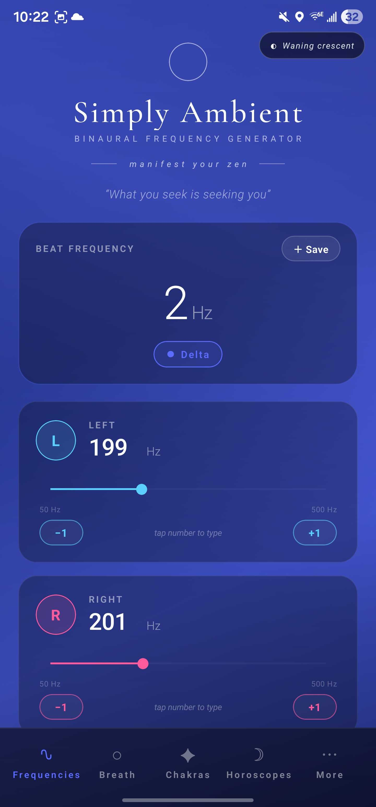
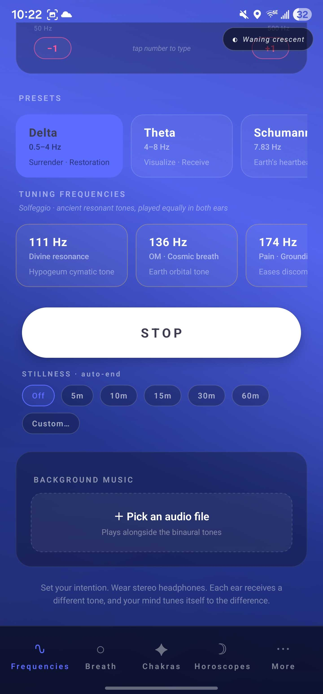
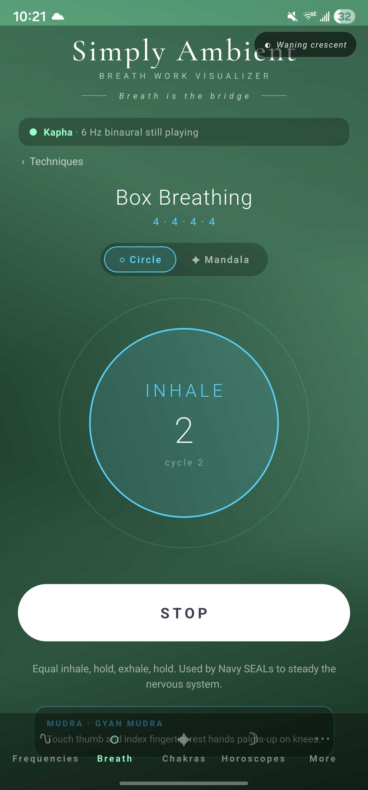
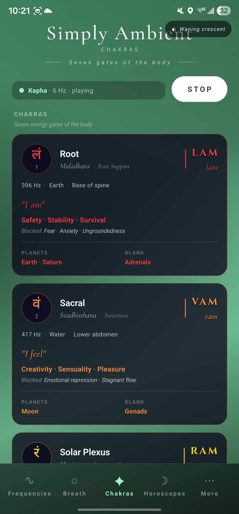

# Simply Ambient

> **Your spiritual center.** A binaural frequency generator, breath-work companion, and ambient spiritual reference for Android and iOS.

<p align="center">
  
  
  
  
</p>

Simply Ambient pairs custom binaural beats with guided breath techniques and grounded spiritual content. Pick a brainwave band, tune each ear independently (or type the exact Hz), layer in your own background music, save your favorite mixes, and step through breath sessions with phase-aware animation. Cross-reference with the chakras and your daily horoscope.

The philosophy is rooted in **New Thought / manifestation**: tune your vibration, set your intention, let the rest follow.

---

## Five tabs

| Tab | Glyph | Contents |
|---|---|---|
| **Frequencies** | ∿ | L/R sliders, brainwave & tuning presets, custom presets, background music, sleep timer |
| **Breath** | ○ | Mala counter (108), 16 breath techniques, circle / polygonal-mandala visualizations, mudras |
| **Chakras** | ✦ | 7 chakras with Devanagari bija glyphs, doshas (Vata/Pitta/Kapha) |
| **Horoscopes** | ☽ | Daily / monthly / yearly horoscopes, zodiac picker, tarot card draw, lunar phase |
| **More** | ⋯ | Daily affirmation + opt-in push, mood check-in, gratitude journal, 5-4-3-2-1 grounding, support, bug report |

Plus a small **lunar-phase chip** in the top-right corner of every screen.

---

## Features

### 🎧 Frequencies tab

- **Independent left / right ear sliders** (50–1000 Hz). Tap any displayed Hz to type it via numpad. **±1 buttons** for fine adjustment.
- **Live audio updates as you slide** — the beat changes in real time, no overlapping playback.
- **Brainwave-band presets** with manifestation-aligned blurbs:
  - **Delta** (0.5–4 Hz) — *Surrender · Restoration*
  - **Theta** (4–8 Hz) — *Visualize · Receive*
  - **Schumann** (7.83 Hz) — *Earth's heartbeat* (the planet's electromagnetic resonance)
  - **Alpha** (8–13 Hz) — *Aligned focus · Allow*
  - **Beta** (13–30 Hz) — *Direct · Take action*
  - **Gamma** (30–100 Hz) — *Insight · Knowing*
  - **Gamma-40** (40 Hz @ 250 Hz carrier) — *Memory · Clarity*
- **Tuning frequencies** — wrapped in a default 6 Hz theta beat so you get both the carrier's resonance and a real binaural beat:
  - **111 Hz** — Hypogeum cymatic tone (archaeo-acoustic)
  - **136 Hz** — OM / Cosmic Earth-orbit tone
  - **174 Hz** — Pain · Grounding (Solfeggio)
  - **256 Hz** — Scientific C / Verdi tuning
  - **285, 396, 417, 432, 444, 528, 639, 741, 852, 963 Hz** — Solfeggio + companion tunings
- **Slide-to-tuning detection** — slide so the carrier hits a tuning frequency (within 1 Hz) and the gold tuning theme + label activate automatically.
- **Custom presets** — name and save the current L/R combination. Long-press a saved chip to delete it. Built-in presets are protected. Stored locally.
- **Background music** — pick any audio file from your device. Plays alongside the binaural tones with its own play/pause and volume slider.

### 🌬 Breath Work tab

Sixteen techniques across two categories:

| Category | Technique | Pattern |
|---|---|---|
| Calming | Box Breathing | 4 in · 4 hold · 4 out · 4 hold |
| Calming | 4-7-8 | 4 in · 7 hold · 8 out |
| Calming | Diaphragmatic | 4 in · 6 out |
| Calming | Pursed-Lip | 2 in · 4 out |
| Calming | Coherent (5·5) | 5 in · 5 out — resonant breathing for HRV |
| Calming | Bhramari (Bee) | 4 in · 8 humming exhale — vagal stimulation |
| Calming | Nadi Shodhana | 4 in · 2 hold · 4 out — alternate-nostril |
| Calming | Sitali (Cooling) | 4 in (through tongue) · 6 out — pitta-cooling |
| Calming | Physiological Sigh | 2 short in · long out — fastest stress reset |
| Activating | Holotropic | 1 in · 1 out (rapid) |
| Activating | Shamanic | 2 in · 1 out |
| Activating | SOMA | 3 in · 1 out · 2 hold |
| Activating | Bhastrika (Bellows) | 1 in · 1 out forceful — energizes |
| Activating | Lion's Breath | 4 in · 4 roar-out — releases facial/throat tension |
| Activating | Kapalabhati | passive in · forceful out — skull-shining breath |

- **Two visual options**, switchable mid-session:
  - **Circle** — minimal scaling ring with phase label and per-second countdown
  - **Mandala** — six nested polygons (triangle → octagon) rotating at three independent rates and scaling with breath; freezes during holds
- **Mudras**: every technique includes a paired hand mudra (Gyan, Anjali, Hakini, Vayu, Apana Vayu, Shanmukhi, Vishnu, Bhairava, Pran, Apana, Chin, …) with placement instructions shown in the session view.
- The binaural tone you set on the Frequencies tab keeps playing while you're on this tab.

### ✦ Chakras tab

Seven chakras with the **actual Devanagari bija mantra glyph** rendered in each chakra's color:

| # | Name | Sanskrit | Bija | Glyph | Element | Hz |
|---|---|---|---|---|---|---|
| 1 | Root | Muladhara | LAM | लं | Earth | 396 |
| 2 | Sacral | Svadhisthana | VAM | वं | Water | 417 |
| 3 | Solar Plexus | Manipura | RAM | रं | Fire | 528 |
| 4 | Heart | Anahata | YAM | यं | Air | 639 |
| 5 | Throat | Vishuddha | HAM | हं | Ether | 741 |
| 6 | Third Eye | Ajna | OM | ॐ | Light | 852 |
| 7 | Crown | Sahasrara | AUM | ॐ | Consciousness | 963 |

Each card shows the bija mantra, element, body location, what it governs, and what blocks look like. Tap to tune both ears around its carrier frequency with a 6 Hz theta beat — the whole app theme shifts to that chakra's color.

### 🌿 Doshas (Ayurveda)

Three Ayurvedic constitutions on the chakra tab — **Vata** (Air + Ether), **Pitta** (Fire + Water), **Kapha** (Earth + Water) — each with its qualities, recommended balancing frequency, and recommended breath technique. Tap to apply.

### ☽ Horoscopes tab

- **Today widget** with the actual date, your sign's glyph, element, and qualities.
- **Three period toggles**: DAILY · MONTHLY · YEARLY.
  - Daily and monthly are pulled live from a free public horoscope API.
  - Yearly uses 12 hand-written "year-ahead" intentions (one per sign) — grounded, manifestation-aligned, not predictive pulp.
- **Lunar phase + percent illumination** at the bottom of the widget (also computed locally from Conway's algorithm).
- **Full 12-zodiac picker** — tap to set your sign. Persisted in local storage.

### ⋯ More tab

The More tab is a hub menu — tapping any item slides a dedicated sub-page in from the right. A 🔥 streak badge appears at the top once you have any activity logged.

- **Profile** sub-page — name, birth date, birth time, birth location, plus a **4-question MBTI mini-quiz** (16-personalities style). Auto-computes your 4-letter type and shows the temperament group (Analyst / Diplomat / Sentinel / Explorer).
- **Compatibility** sub-page — your profile plus a separate "other person" entry form (name, birth date, time, location). Synastry analysis is scaffolded; full natal-chart matching ships in a follow-up.
- **AI Insights** sub-page — paste a free Gemini API key (from aistudio.google.com), then get **AI thematic analysis of your mood + gratitude journal** or an **AI tarot interpretation** of the current card. Prompts and journal data only leave the device when you tap a button.
- **Daily Affirmation** sub-page — large rotating affirmation card (live from `affirmations.dev`) plus opt-in notification settings: Off / 1× per day (9 a.m.) / 3× per day (9 a.m., 1 p.m., 6 p.m.), scheduled locally via `expo-notifications`.
- **Mood** sub-page — 1–5 color-coded buttons + a **14-day SVG line graph** of daily-average mood + a scrollable history list (up to 365 entries persisted).
- **Gratitude** sub-page — multi-line entry box + dedicated journal grouped by date. Up to 1000 entries persisted locally.
- **5-4-3-2-1 Grounding** sub-page — full sensory walk-through, one card per sense.
- **Support** sub-page — opens Buy Me a Coffee link with a hero card.
- **Report a Bug** sub-page — tries the FormSubmit silent submission first, then falls back to opening the user's mail app pre-filled. The developer's email is base64-encoded in the source so it doesn't appear as plaintext in the bundle and is never displayed in the UI.

### Gratitude streak

A flower badge on the More hub shows your consecutive-day **gratitude streak** — counts up each day you save a gratitude entry, resets if you skip more than one day. Streaks are deliberately tied to gratitude (not just app opens) because writing one thing you appreciate, daily, is the most consistent positive-psychology lever in this app.

### Mala counter haptics

The mala counter offers Off / Low / High vibration on each tap, plus a success vibration when you reach 108. Persisted locally.

### Weekly insights

A small card at the top of the More hub summarises this week: average mood (with up/down trend versus last week), number of mood check-ins, number of gratitudes. Pulls entirely from your local data; nothing is sent anywhere.

### First-launch onboarding

A 3-step welcome on first launch:
1. Welcome + tagline
2. "What brings you here?" — Sleep / Focus / Calm / Energy
3. Tailored recommendations: one frequency preset + one breath technique + one chakra, with reasons.

The onboarded flag is stored in AsyncStorage so it only shows once.

### 💤 Sleep timer

On the Frequencies tab, just below the Play button. Off / 5m / 10m / 15m / 30m / 60m. When the timer fires, audio is gracefully released.

### 📿 Mala counter

On the Breath tab. Tap-to-count to 108 with a progress bar, "Reset" button, and a "✓ Complete" state. Pairs naturally with the breath techniques and bija mantras.

### 🃏 Tarot

On the Horoscopes tab. Pulls a single random card from the public Tarot API on first open, with a refresh button to draw again. Shows the card name, upright meaning, and a snippet of description.

### 🎨 Living background

- Rich diagonal base gradient + two cross-fading diagonal gradient layers in opposing directions, plus a slow vertical accent stripe drifting upward.
- All animation **freezes when no frequency is playing** so you only see motion during a session.
- The palette swaps when you choose a new preset (chakras get their own saturated red→violet palettes).
- A small lunar-phase pill ( ◐ Waxing crescent ) sits in the top-right corner on every screen, positioned below the status bar via `useSafeAreaInsets`.

### 💭 Manifestation language

A rotating set of New Thought aphorisms drifts across the top of the Frequencies tab:
*"Thoughts become things" · "Energy flows where attention goes" · "What you seek is seeking you" · "You attract what you vibrate" · "As within, so without" · "Tune in. Receive." · "Be still, and know"*

---

## Tech stack

- **React Native** + **Expo SDK 54** — single codebase for iOS and Android
- **TypeScript**
- **expo-audio** — playback (and synthesized stereo PCM WAV for the binaural tones)
- **expo-document-picker** — picking the user's background audio file
- **expo-file-system** — caching the synthesized WAV between frequency changes
- **expo-font** + **@expo-google-fonts/cormorant-garamond** — elegant serif for the wordmark
- **@react-native-async-storage/async-storage** — persisting custom presets, user's zodiac
- **@react-native-community/slider**
- **expo-linear-gradient** — gradient layers for the living background
- **react-native-svg** — polygons for the mandala visualization, mood graph
- **react-native-safe-area-context**
- **expo-notifications** — local-only scheduled push notifications for affirmations
- **expo-linking** — opening external donation URLs and `mailto:` for bug reports
- **expo-constants** — Expo Go vs standalone build detection (notifications gate)
- **Gemini API** (Google) — optional, user-supplied API key for AI insights

### How the binaural audio works

Every time the frequency changes, a **1-second 44.1 kHz 16-bit stereo PCM WAV** is generated in JavaScript — one full cycle of the left tone in the L channel, one of the right tone in the R channel, integer Hz so the 1-second loop closes seamlessly. The bytes are base64-encoded, written to `FileSystem.cacheDirectory`, and loaded into a single persistent `AudioPlayer` via `.replace()` so there's never a second player overlapping the first. Slider drags are throttled to ~220 ms to keep audio responsive without thrashing the synthesizer.

### How the horoscopes work

Daily and monthly horoscopes are fetched from `freehoroscopeapi.com` — a free public API that returns plain JSON. Yearly horoscopes are local: each of the 12 zodiac signs has a hand-written one-paragraph "year ahead" intention bundled into the app. The user's chosen zodiac sign is persisted in `AsyncStorage` so the next launch defaults to the same sign.

---

## Running locally

```bash
npm install
npx expo start
```

### Standalone build (EAS)

`eas.json` is included with three profiles:

```bash
npm install -g eas-cli
eas login
eas build --platform android --profile preview   # APK you can sideload
eas build --platform ios --profile development     # iOS dev client
eas build --platform all --profile production      # store-ready
```

Required for: notifications to actually fire (Expo Go can't do them in SDK 53+), the leaf icon to replace Expo Go's icon, and Apple Health / Google Fit when those land.

Then either:

- **Phone (easiest)**: install **Expo Go**, scan the QR code that prints in the terminal. Phone and computer must be on the same Wi-Fi.
- **iOS Simulator**: press `i` in the Expo terminal (Xcode required).
- **Android Emulator**: press `a` (Android Studio + an AVD required).

> ⚠️ **Use stereo headphones** to perceive the binaural beat. Phone speakers mix the L and R channels and the effect disappears.

---

## Project structure

```
.
├── App.tsx                  # Tabs, state, audio, frequencies UI, animated background, zodiac/lunar data
├── BreathworkView.tsx       # 16 breath techniques + circle and polygonal-mandala visuals + mudras
├── ChakrasView.tsx          # 7 chakras (Devanagari bijas) + doshas
├── HoroscopesView.tsx       # Today widget, daily/monthly/yearly horoscopes (cached), zodiac picker, tarot
├── MoreView.tsx             # Hub: Profile (MBTI), Compatibility, AI Insights, Affirmations, Mood + graph,
│                            #      Gratitude, Grounding, Support, Bug report
├── OnboardingView.tsx       # First-launch 3-step welcome → intent → recommendations
├── eas.json                 # EAS build profiles (development / preview / production)
├── app.json                 # Expo config (icon, splash, plugins)
├── assets/                  # Icons, splash, store graphics, README screenshots
├── index.ts                 # Expo entry point
├── package.json
└── tsconfig.json
```

---

## Roadmap

Shipped lately:

- ✅ Sleep / standalone EAS build *(planned)*
- ✅ Lunar phase indicator (Conway's algorithm)
- ✅ Chakras with Devanagari bijas
- ✅ Doshas
- ✅ Mudras paired with breath techniques
- ✅ Horoscopes tab (daily / monthly / yearly)
- ✅ Persistent user zodiac sign
- ✅ Manifestation rotating quotes
- ✅ Slide-to-tuning auto-detection
- ✅ Live slider audio with no overlap

Considering next (open for input):

**Habit & insight**
- **Streaks** — track consecutive days with any session (binaural / breath / chakra / mood / gratitude). One number on the More hub, history view in a sub-page.
- **Weekly insights** — auto-generated summary card: average mood, sessions per category, most-used preset, gratitude count. Pulls from data we already store.
- **Onboarding flow** — first-launch wizard: ask the user's intent (sleep / focus / calm / energy) and recommend three presets + one breath technique tailored to it.

**Audio**
- **Built-in soundscapes** — rain, ocean, forest, fireplace, brown/pink noise. Bundled audio files. Can layer with the binaural and the user's MP3 — three independent volumes.
- **Routines / session sequencer** — chain multiple presets ("10 min alpha → 15 min theta → fade out"). Save and share.
- **Bija mantra audio** — short loops of LAM / VAM / RAM / OM for each chakra.

**Integrations & sync**
- **Apple Health / Google Fit** — log breath sessions as mindfulness minutes, mood as wellbeing data.
- **iCloud / Drive backup** — export presets, gratitude, mood log to cloud. Sync between devices.
- **Widgets / Lock screen** — daily affirmation widget; quick-play preset from home screen.
- **Apple Watch / Wear OS companion** — quick controls during a session.

**Spiritual / content**
- **Mantra library** — Gayatri, Maha Mrityunjaya, Loving-Kindness phrases, with description and optional chant audio.
- **Yoga Nidra** — guided body-scan audio or text.
- **Sacred geometry visualizer** — frequency-reactive cymatic patterns behind the play screen.
- **I Ching / runes daily draw** — companion to the tarot daily card.

**Polish**
- **Standalone EAS build** so the leaf icon and notifications work outside Expo Go.
- **Shareable preset / quote cards** — render a beautiful image of a saved preset or affirmation for sharing.
- **Light theme** — alternative palette for daytime use.
- **Tutorial / first-run tooltips** — surface less-obvious features (slide-to-tuning, long-press-to-delete, etc.).

---

## Credits & inspiration

- Background animation inspired by [Rowno's "Chameleon background"](https://codepen.io/Rowno/pen/EVEgJb)
- Brainwave-band conventions from standard EEG / neuroscience literature
- Solfeggio frequency intents drawn from sound-healing tradition
- Chakra system from yogic / tantric tradition; bija mantras in Devanagari
- Doshas from Ayurveda
- Horoscope API: [freehoroscopeapi.com](https://freehoroscopeapi.com/)
- Lunar phase: Conway's algorithm
- Tropical zodiac date conventions
- New Thought aphorisms from Wallace Wattles, Florence Scovel Shinn, Ernest Holmes, and similar lineage
- Cormorant Garamond font by Christian Thalmann (SIL OFL)

---

## License

No license set yet — code provided as-is.
